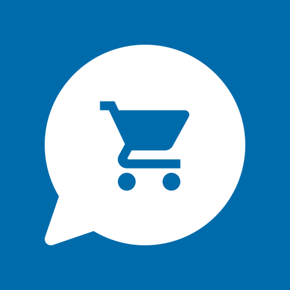

<h2> WhatsLeft?
  
  
</h2>

**WhatsLeft is a crowd-sourced solution to see which items grocery stores have left in stock.**

Die Android-App verwendet Java und wurde in weniger als 48 Stunden als Teil von [#WirvsVirusHack](https://wirvsvirushackathon.org) geschrieben, einem Hackathon, der von der deutschen Regierung organisiert wurde, um eine Lösung für die Probleme in der Coronakrise zu finden.

Ein Like auf unser Youtube-Video würde uns sehr helfen:

## Weitere Dokumentationen: 

- [Allgemeine Infos](https://devpost.com/software/17_stock_tracking_crowd)
- [Web App](https://github.com/WVV-Crowd-Sourced-Stock-Tracking/Web) 
- [iOS App](https://github.com/WVV-Crowd-Sourced-Stock-Tracking/ios-App)
- [REST-API / Backend](https://github.com/WVV-Crowd-Sourced-Stock-Tracking/Backend)
- [REST-API / Python-Backend](https://github.com/WVV-Crowd-Sourced-Stock-Tracking/Backend-python)

## Activities

Die Activities sind die grundlegenden Views, mit denen der Nutzer interagiert. Die `MainActivity` oder die `DetailActivity` sind Beispiele für Activities. Für jede neue größeren Bereich der App wird eine neue Activity genutzt.

## Views

In den Activites gibt es verschiedene Views, die unabhänging von den im Hintergrund verarbeiteten `Store`-und `Product`-Objekten sind. So gibt es beispielsweise in der `DetailActivity` eine ListView, die viele SubViews beinhaltet, die ein Produkt durch den gegebenen Namen und der angezeigten Verfügbaren Menge repräsentieren.

Wenn nun Änderungen an den Views vorgenommen werden, werden erst mit klicken des Speichern-Knopfes die Daten ausgewertet und den Produkten zugewiesen. Diese stickte Trennung von Stores, Produkten und Views, also der Trennung von FrontEnd und "Backend", wahrt einerseits die Übersichtlichkeit des Codes und andererseites ermöglicht sie flexible View updates, wenn aktualisiertere Daten vorliegen.

## Kommunikation mit den Backend

Die Kommunikation mit den Backend findet über eine REST-API statt. Diese findet über die Klassen im Package `de.whatsleft.connectivity` statt. `APIRequest` ist ein `AsyncTask`. Alle anderen Klassen erben von `APIRequest`  und überschreiben die `onPostExecute`-Methode.

## Screenshots

  
  
   

